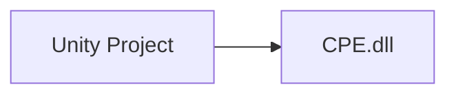

# CPE 

Requirements:
- [Docker](https://www.docker.com/products/docker-desktop/)
- [VSCode](https://code.visualstudio.com/)
    - [devcontainers](https://code.visualstudio.com/docs/devcontainers/containers) VSCode extension


## Project 



## Development setup
 
Re-open vscode in devcontainer then
```bash
dotnet build ./projects
```

to test execute
```bash
dotnet test ./projects
```